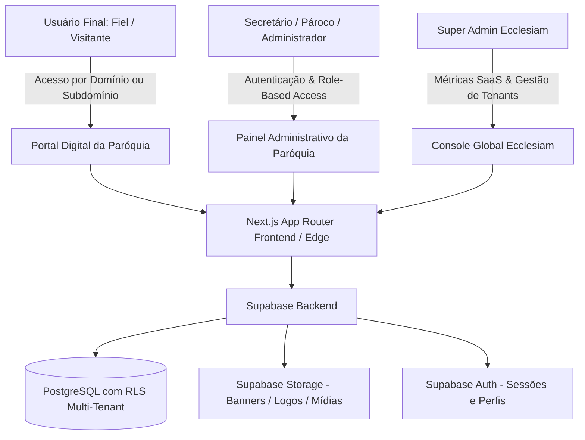

# 📖 MANIFESTO ECCLESIAM: FONTE ÚNICA DA VERDADE (SSOT)

> **Documento Base e Arquitetura de Negócio**  
> **Versão:** 1.0 (MVP)  
> **Status:** Ativo / Em Desenvolvimento  
> **Data:** Setembro de 2026  

---

## 1. 🌟 Visão Geral do Produto e Filosofia White-Label

O **Ecclesiam App** é uma **Plataforma SaaS Multi-Cliente (White-Label)** moderna, concebida para atender paróquias, dioceses e comunidades católicas em sua presença e acolhimento digital. Nascido a partir da experiência bem-sucedida desenvolvida para a Catedral do Sagrado Coração de Jesus (Catedral de Colatina), o sistema foi repensado e desenhado desde a sua primeira linha de código para atuar como uma solução escalável, multi-inquilino (*multi-tenant*) e de altíssima performance.

### 👑 A Regra de Ouro do White-Label
> **"A marca Ecclesiam é 100% invisível para o fiel."**

* Toda a experiência de ponta do paroquiano — seja acessando o portal web responsivo pelo smartphone, seja navegando no aplicativo móvel dedicado — é estritamente centrada na **marca, no brasão/logotipo, nas cores litúrgicas e institucionais e na identidade pastoral da paróquia cliente**.
* O fiel nunca deve se sentir navegando em um sistema compartilhado ou genérico: para ele, aquele é o **Portal e Aplicativo Oficial da sua própria Paróquia**.
* A menção "Ecclesiam" existe exclusivamente nos bastidores da infraestrutura técnica, nos ambientes de cobrança SaaS da plataforma e na documentação interna de engenharia.

---

## 2. 🎯 Foco e Delimitação do MVP (Mínimo Produto Viável)

O objetivo primordial do MVP é entregar valor imediato, estabilidade e facilidade de adoção para as secretarias paroquiais e padres, resolvendo as maiores dores de comunicação e arrecadação sem inflar a complexidade inicial de desenvolvimento.

### 📌 Pilares Centrais do MVP:

1. **Gestor de Conteúdo Paroquial Dinâmico (CMS Pastoral):**
   * Publicação ágil e intuitiva de avisos paroquiais, comunicados urgentes, notícias, artigos pastorais e mural de eventos.
   * Interface pensada para secretários paroquiais com baixa familiaridade técnica (estilo "WordPress" simplificado e focado na rotina da Igreja).

2. **Gestão e Consulta Inteligente de Horários:**
   * Módulo estruturado para horários fixos e sazonais de:
     * Santas Missas (matriz e comunidades/capelas vinculadas).
     * Confissões e Direção Espiritual.
     * Expediente da Secretaria Paroquial.
   * Apresentação limpa, clara e de rápido acesso para o fiel pelo celular ou computador.

3. **Módulo de Arrecadação e Dízimo via PIX:**
   * Geração automatizada e dinâmica de QR Code PIX (Copia e Cola + QR Code visual).
   * Suporte a doações de Dízimo, Ofertas e Intenções de Santa Missa.
   * Rastreabilidade, relatórios claros de transações para prestação de contas no painel administrativo e facilidade de auditoria.

4. **Central de Atendimento e Atos Pastorais Rápidos:**
   * Botão e fluxos diretos de conexão via WhatsApp com a secretaria paroquial.
   * Transmissões ao vivo integradas (links para YouTube / redes sociais).

5. **Personalização Visual Flexível (Theming):**
   * Configuração de logotipo, brasão, imagem de capa, cores primárias/secundárias e dados institucionais no painel da paróquia, refletindo instantaneamente no portal digital do cliente.

---

### ⛔ Fora do Escopo do MVP (O que NÃO fazer agora):
Para garantir velocidade de lançamento e evitar sobrecarga de engenharia:
* **Não implementar** ERP contábil e financeiro pesado de secretaria.
* **Não implementar** emissão e registro canônico de certidões de batismo, crisma ou matrimônio.
* **Não implementar** gestão de cemitérios paroquiais ou patrimônio imobiliário físico complexo.
* Todos esses recursos corporativos de secretaria tradicional são candidatos para versões futuras pós-validação de mercado.

---

## 3. 🏗️ Arquitetura do Sistema e Estrutura de Ambientes

O ecossistema é projetado com isolamento lógico multi-tenant, permitindo que uma única base de código atenda com segurança e alta performance centenas de paróquias simultâneas:

### 3.1 Painel Administrativo da Paróquia (`/admin`)
* **Público:** Pároco, vigários, secretários(as) e equipe de comunicação da paróquia.
* **Funcionalidades:**
  * Dashboard com métricas de acessos, postagens ativas e arrecadações PIX.
  * Cadastro e edição de avisos, notícias e mural.
  * Tabela interativa de horários de missas e confissões com filtros por comunidade.
  * Visualização de intenções de missa e registros de dízimo recebidos via PIX.
  * Configurações de perfil e customização de tema (logotipo, cores primárias, links sociais).

### 3.2 O Portal Digital da Paróquia (`/` e sub-rotas públicas do fiel)
* **Público:** O fiel paroquiano e visitantes.
* **Identidade:** 100% personalizada para a paróquia. Sem qualquer logotipo ou referência proeminente ao Ecclesiam.
* **Funcionalidades:**
  * Hero Section acolhedora com os próximos horários de missa em tempo real.
  * Feed de notícias e avisos pastorais.
  * Página dedicada de Dízimo e Doações com checkout PIX intuitivo.
  * Seção de transmissão ao vivo das celebrações.
  * Contato direto com a secretaria e comunidades associadas.

### 3.3 Roadmap do Aplicativo Dedicado (Mobile White-Label)
* Em fase subsequente ao portal web, cada paróquia poderá contar com seu próprio aplicativo compilado para Android e iOS (React Native / Expo), conectado à mesma API e banco Supabase, provendo notificações push de horários e avisos litúrgicos.

---

## 4. 💻 Stack Tecnológica Oficial

| Camada | Tecnologia | Justificativa Técnica |
| :--- | :--- | :--- |
| **Frontend & SSR** | **Next.js 15+ (App Router)** | Performance em Edge, SEO otimizado para as paróquias, rotas paralelas e layouts isolados para admin e portal público. |
| **Linguagem** | **TypeScript** | Segurança de tipos estrita, integridade nas entidades de paróquias, eventos e pagamentos. |
| **Estilização** | **Tailwind CSS + CSS Variables** | Facilidade para theming dinâmico por tenant (cores da paróquia injetadas via variáveis CSS) e suporte a Dark Mode. |
| **Backend & Dados** | **Supabase (PostgreSQL)** | Escalabilidade relacional com Row Level Security (RLS) mandatório para isolamento absoluto entre paróquias. |
| **Autenticação** | **Supabase Auth** | Gerenciamento de sessões com JWT, RBAC (Role-Based Access Control) para párocos, secretários e administradores. |
| **Storage de Mídias**| **Supabase Storage** | Armazenamento de logotipos, imagens de notícias, banners e comprovantes com políticas de leitura pública/restrita. |
| **Mobile (Roadmap)**| **React Native (Expo EAS)** | Facilidade de automação de compilação e publicação multi-cliente white-label nas lojas de apps. |

---

## 5. 🛡️ Princípios de Engenharia e Boas Práticas

1. **Segurança Multi-Tenant Absoluta (RLS First):**
   * Toda e qualquer tabela do banco que contenha dados de uma paróquia DEVE possuir a coluna `parish_id` com chave estrangeira e RLS ativado. É inadmissível que uma paróquia acesse dados de outra.
2. **Design Limpo e Acolhedor (Experiência Pastoral):**
   * Interfaces pensadas para todas as idades, com tipografia legível, contraste adequado, tempos de carregamento instantâneos e facilidade máxima de uso para idosos e fiéis no celular.
3. **Resiliência e Zero-Downtime:**
   * Separação clara entre a lógica de apresentação e os serviços de dados.
   * Uso rigoroso de TypeScript e compilação limpa (`npm run build`) prévia a qualquer deploy ou push.
4. **Respeito aos Protocolos Operacionais:**
   * Adoção integral dos protocolos de desenvolvimento herdados da metodologia comprovada da Start Agência Digital (Protocolo Start, Git Point, Dev UX/UI, Segurança e Anti-Monolito).
