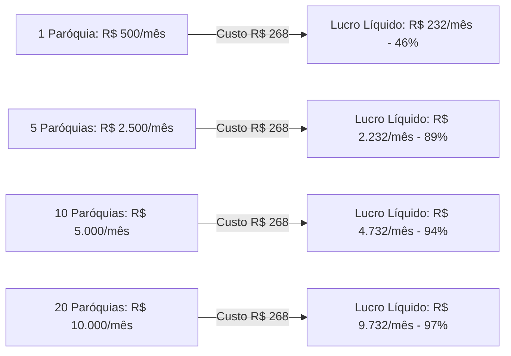

# 💰 Análise de Custos de Infraestrutura e Escalabilidade — Ecclesiam App

> **Documento Oficial de Engenharia Financeira e Infraestrutura**  
> **Status:** Aprovado  
> **Versão:** 1.0  
> **Data:** Setembro de 2026  

---

## 📌 1. Resumo Financeiro da Infraestrutura

| Serviço | Função na Plataforma | Plano Gratuito (Fase Inicial) | Plano Pro (Produção Comercial) | Custo em Reais (com IOF)* |
| :--- | :--- | :---: | :---: | :---: |
| **Vercel** | Hospedagem Next.js 16, Edge SSR, Domínios das Paróquias | $0,00 | $20,00 / mês | **R$ 119,00 / mês** |
| **Supabase** | Banco PostgreSQL, Auth para 100k fiéis, RLS, Storage | $0,00 | $25,00 / mês | **R$ 149,00 / mês** |
| **Cloudflare** | CDN no Brasil, Proxy de Cache (80%), Firewall e SSL | $0,00 | $0,00 (Plano Free permanente) | **R$ 0,00 / mês** |
| **Resend** | Envio de código OTP de 6 dígitos e Magic Link (até 3.000/mês) | $0,00 | $0,00 (Plano Free permanente) | **R$ 0,00 / mês** |
| **TOTAL MENSAL** | **Infraestrutura Completa Nível Corporativo** | **R$ 0,00 / mês** | **$45,00 / mês** | **~ R$ 268,00 / mês** |

*\*Estimativa baseada no dólar a R$ 5,70 + IOF de cartão internacional (~4,38%).*

---

## 🟢 2. Como Operar a R$ 0,00 (Planos Gratuitos no Início)

Você **pode e deve** iniciar o projeto, testes, homologação e o piloto com a Catedral de Colatina utilizando **100% dos planos gratuitos**:

### A. Vercel Hobby ($0 / R$ 0)
* **Capacidade:** 100 GB de largura de banda por mês (sustenta entre **50.000 a 80.000 acessos mensais** ao site).
* **Domínio Customizado:** Permite apontar o domínio oficial da paróquia (ex: `catedraldecolatina.org.br`) sem cobrança.
* **Limitação Formal:** A Vercel estabelece que o plano Hobby é para uso pessoal. É prática de mercado homologar o app no Hobby e migrar para o Pro apenas após a contratação formal.

### B. Supabase Free Tier ($0 / R$ 0)
* **Capacidade de Dados:** 500 MB no banco Postgres. Como o registro de um fiel ou horário ocupa ~1 KB, 500 MB comportam **mais de 40.000 fiéis cadastrados** e anos de postagens de avisos e horários.
* **Usuários Ativos (Auth):** Até 50.000 fiéis ativos por mês.
* **Armazenamento de Mídias (Storage):** 1 GB para fotos de padres, capelas e PDFs de folhetos de missa.

### C. Como Contornar os 2 Gargalos do Supabase Free sem Pagar Nada:
1. **Gargalo de E-mail (Rate Limit):**
   * O servidor padrão do Supabase bloqueia após 30 a 60 e-mails por hora.
   * **Solução a R$ 0:** Criar conta gratuita no **Resend** (3.000 envios grátis/mês) e colar as credenciais SMTP no Supabase (*Settings > Auth > SMTP*). Os códigos OTP chegam em < 1 segundo sem bloqueio.
2. **Pausa Automática por Inatividade (7 dias):**
   * O Supabase Free pausa o banco se ele ficar 7 dias consecutivos sem nenhum acesso.
   * **Na prática:** Como a paróquia terá fiéis e secretários acessando diariamente, o banco **nunca pausará**.

---

## 📈 3. Viabilidade Econômica do Modelo SaaS Multi-Tenant

> [!IMPORTANT]
> O custo de **~R$ 268,00/mês NÃO se multiplica por paróquia**. Uma única infraestrutura Pro atende com folga a Catedral de Colatina e mais de 10 a 20 paróquias simultâneas.

### Cenários de Lucratividade com Mensalidade Paroquial de R$ 500,00 / mês:

---

## 🚦 4. Quando Virar a Chave para o Plano Pago (Gatilhos de Upgrade)

Recomenda-se realizar o upgrade para os planos Pro ($45 / ~R$ 268/mês) **apenas quando ocorrer qualquer um dos seguintes gatilhos**:
1. **Contrato Assinado:** A Catedral de Colatina oficializar o contrato mensal de serviço.
2. **Lançamento Oficial no Altar:** Quando o pároco divulgar nas missas dominicais o aplicativo para toda a assembleia (evita qualquer risco de cota).
3. **Backups Diários com Retenção Estendida:** Quando a paróquia exigir SLA formal de garantia e restauração de dados em caso de incidentes.

O processo de upgrade na Vercel e no Supabase é instantâneo (feito em 1 clique com cartão de crédito), sem necessidade de reconfigurar ou parar o sistema.
