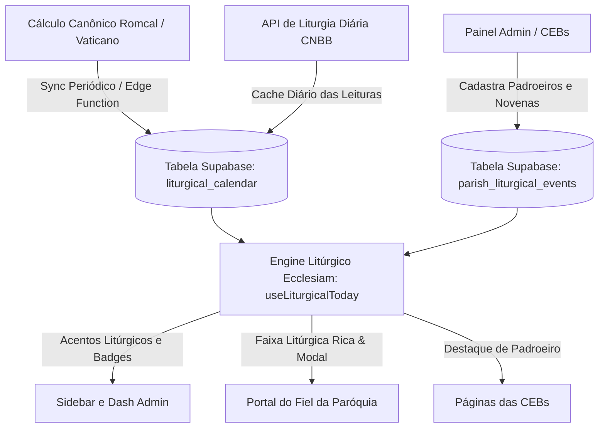

# 🕊️ Escopo Técnico: Calendário Litúrgico Inteligente & Identidade Cromática Dinâmica

> **Documento Oficial de Especificação Funcional e Arquitetural**  
> **Status:** Aprovado via `/grill-me`  
> **Data:** Outubro de 2026  
> **Versão:** 1.0  

---

## 📌 1. Visão Geral da Funcionalidade

O **Calendário Litúrgico Inteligente** conecta o Ecclesiam App ao ritmo do Ano Litúrgico da Igreja Católica universal e local. O sistema responde dinamicamente às cores das vestes litúrgicas de forma sutil, tanto no **Portal Público do Fiel** quanto no **Painel Administrativo da Paróquia**, além de empoderar a Matriz e as Comunidades (CEBs) no agendamento de seus Santos Padroeiros, Novenas e Tríduos.

---

## 🎨 2. Paleta Canônica e Resposta Cromática Sutil

A aplicação visual deve ser **elegante, sutil e equilibrada**, respeitando os tokens do Design System (`--dash-surface`, `--dash-bg`, `--dash-border`) sem causar fadiga visual:

| Tempo / Celebração | Cor Canônica | Significado | Aplicação Visual (Acentos) |
| :--- | :--- | :--- | :--- |
| **Tempo Comum** | **Verde** (`#15803d` / `#16a34a`) | Esperança, perseverança e vida cristã | Acentos e badges em esmeralda refinado |
| **Quaresma & Advento** | **Roxo / Violeta** (`#6b21a8` / `#7e22ce`) | Penitência, conversão, vigilância e espera | Glow e bordas em púrpura/violeta profundo |
| **Santos Mártires, Pentecostes, Ramos & Paixão** | **Vermelho** (`#b91c1c` / `#dc2626`) | Fogo do Espírito Santo e sangue do martírio | Destaques sutis em rubi solene |
| **Solenidades, Festas do Senhor e da Virgem Maria** | **Branco / Dourado** (`#ca8a04` / `#fef08a`) | Glória, pureza, luz e santidade | Filetes dourados e badges luminosos |
| **Domingo Gaudete & Laetare** (Opcional) | **Rosa** (`#db2777` / `#be185d`) | Alegria antecipada no Advento e Quaresma | Acento sutil rosáceo |

---

## 💻 3. Aplicação no Painel Administrativo (`/admin`)

### 3.1 Sidebar com Acentos Litúrgicos Elegantes
* **Estrutura Neutra Preservada:** O fundo da barra lateral permanece escuro/neutro (`var(--dash-surface)`), garantindo alta legibilidade e conforto visual prolongado.
* **Indicador de Borda/Glow:** Uma linha ou borda luminosa sutil (2px a 4px) na lateral ativa da sidebar reflete a cor litúrgica do dia.
* **Badge no Cabeçalho da Sidebar:** Logo abaixo do nome da Paróquia, exibe um chip com a cor do dia e a denominação oficial (Ex: `🟢 Tempo Comum • 26ª Semana` ou `🟣 Tempo do Advento • 1º Domingo`).

### 3.2 Nova Tela: Calendário Litúrgico e Gestão de Festas (`/admin/calendario`)
* **Grade Mensal Interativa:** Visualização do mês com identificação visual instantânea das cores de cada dia.
* **Modal de Cadastro de Festas Especiais:**
  * Nome da Celebração (Ex: *Festa da Padroeira Nossa Senhora do Perpétuo Socorro*).
  * Vínculo: Matriz ou seleção da **CEB correspondente** (entre as 11 comunidades cadastradas).
  * Data de Início e Término (para Novenas, Tríduos ou Dia Solene).
  * Cor Litúrgica para a celebração (Branco, Vermelho, etc.).
  * Override de Cor: Possibilidade de forçar a cor litúrgica paroquial para ocasiões pontuais (ex: Missa de Crisma em vermelho ou Exéquias em roxo).

---

## 🌐 4. Aplicação no Portal Público do Fiel (Home & CEBs)

### 4.1 Faixa Litúrgica Rica (Logo abaixo do Hero/Slide)
* **Localização Estratégica:** Posicionada logo abaixo da seção de boas-vindas / banners da Home da Paróquia.
* **Conteúdo Rico:**
  * Indicador da cor do dia com ícone de estola/cálice e identificação canônica.
  * Título da celebração (Ex: *São Jerônimo, Presbítero e Doutor da Igreja • Memória*).
  * Resumo do Evangelho ou citação bíblica da Liturgia Diária.
  * Botão de Ação: **"Ver Liturgia Diária Completa"** (abre modal/drawer com 1ª Leitura, Salmo Responsorial, 2ª Leitura e Evangelho completo).

### 4.2 Integração com as Comunidades (CEBs)
* **Visão Integrada na Home:** As festas de padroeiros das CEBs aparecem no calendário paroquial com etiqueta da comunidade (ex: `Capela Santa Luzia`).
* **Destaque na Página da CEB (`/comunidades/[slug]`):** No período de novena ou dia da festa do padroeiro da capela, a página daquela CEB assume o destaque solene próprio.

---

## ⚙️ 5. Arquitetura Técnica: Motor Híbrido Resiliente

Para garantir **velocidade instantânea, resiliência total contra quedas de APIs externas e suporte a eventos locais**:

### 5.1 Tabelas no Supabase (PostgreSQL)

1. `public.liturgical_calendar`:
   * Calendário universal canônico pré-gerado (365 dias/ano), com `date`, `season`, `celebration_name`, `rank`, `color`, `cycles`.
2. `public.liturgical_readings`:
   * Leituras bíblicas da liturgia diária (CNBB) cacheadas por data: `first_reading`, `psalm`, `second_reading`, `gospel`.
3. `public.parish_liturgical_events`:
   * Eventos próprios da paróquia e CEBs: `parish_id`, `community_id` (opcional), `title`, `start_date`, `end_date`, `color_override`, `event_type` (`patronal_feast`, `novena`, `triduum`, `special_mass`).

### 5.2 Automação e Virada de Dia
* A virada da cor litúrgica ocorre automaticamente às **00:00 (Fuso Horário de Brasília / `America/Sao_Paulo`)**.
* O pároco ou secretária pode aplicar sobreposições manuais pontuais a qualquer momento pelo painel.
