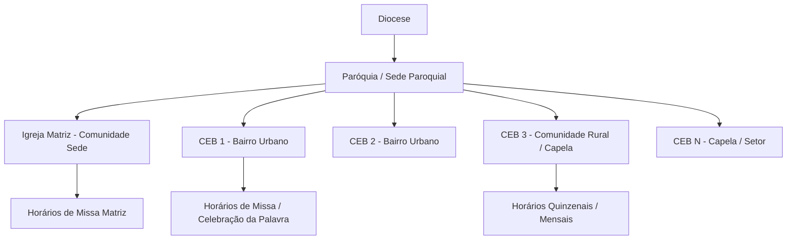

# ⛪ Escopo de Arquitetura: Hierarquia Paroquial e Módulo de CEBs

> **Documento de Especificação Técnica e Funcional**  
> **Módulo:** Gestão de Comunidades Eclesiais de Base (CEBs) e Capelas  
> **Status:** Aprovado para Implementação  
> **Versão:** 1.0  

---

## 1. 🌟 Contexto Pastoral e Necessidade de Negócio

No modelo eclesial católico (especialmente no Brasil e nas dioceses do interior, como Colatina/ES), uma paróquia não é apenas um templo isolado. Ela se organiza canônica e pastoralmente como uma **"Rede de Comunidades"**:

### Problema Atual:
Sem uma hierarquia formal, os horários e avisos no sistema ficavam soltos em campos de texto livre (`"Comunidade São Pedro"`), gerando duplicidades de grafia, impossibilidade de filtros precisos para os fiéis e desorganização na agenda dos padres.

### Solução:
Implementar o **Cadastro e Hierarquia de CEBs (Comunidades)** vinculado à Paróquia (`parish_id`), permitindo:
1. **Secretaria Paroquial:** Cadastrar e organizar todas as capelas e comunidades urbanas/rurais da paróquia.
2. **Vínculo Relacional:** Conectar horários de missas, cultos, confissões e notícias diretamente à respectiva comunidade.
3. **Portal do Fiel:** O paroquiano pode filtrar celebrações especificamente para a sua capela ou bairro, com mapa de localização GPS e detalhes da festa do padroeiro local.

---

## 2. 🗄️ Modelagem de Dados Relacional (PostgreSQL / Supabase)

### Tabela `communities` (CEBs / Capelas)
| Coluna | Tipo | Restrições | Descrição |
| :--- | :--- | :--- | :--- |
| `id` | `UUID` | `PRIMARY KEY DEFAULT gen_random_uuid()` | Identificador único da comunidade |
| `parish_id` | `UUID` | `NOT NULL REFERENCES parishes(id) ON DELETE CASCADE` | Paróquia detentora (Multi-Tenant) |
| `name` | `TEXT` | `NOT NULL` | Ex: "Comunidade São José Operário" |
| `patron_saint` | `TEXT` | `NULL` | Padroeiro (ex: "São José Operário") |
| `is_headquarters`| `BOOLEAN` | `NOT NULL DEFAULT FALSE` | `TRUE` se for a Igreja Matriz |
| `address` | `TEXT` | `NULL` | Rua, número ou localidade rural |
| `neighborhood` | `TEXT` | `NULL` | Bairro ou Distrito |
| `city` | `TEXT` | `NOT NULL` | Cidade |
| `latitude` | `FLOAT8` | `NULL` | Coordenada GPS para rotas no mapa |
| `longitude` | `FLOAT8` | `NULL` | Coordenada GPS para rotas no mapa |
| `image_url` | `TEXT` | `NULL` | Foto da fachada da capela |
| `contact_name` | `TEXT` | `NULL` | Coordenador(a) da comunidade |
| `contact_phone`| `TEXT` | `NULL` | Telefone/WhatsApp da coordenação local |
| `is_active` | `BOOLEAN` | `NOT NULL DEFAULT TRUE` | Ativação/Visibilidade no portal |
| `created_at` | `TIMESTAMPTZ`| `NOT NULL DEFAULT now()` | Data de cadastro |
| `updated_at` | `TIMESTAMPTZ`| `NOT NULL DEFAULT now()` | Última atualização |

---

## 3. 🔗 Relacionamentos no Banco de Dados

1. **Horários de Missas (`mass_schedules`):**
   * Substituição do campo de texto solto `location_name` por uma Foreign Key:
     `community_id UUID REFERENCES communities(id) ON DELETE CASCADE`
   * Permite consultas otimizadas: *"Buscar todas as missas da CEB X"*.
2. **Avisos e Notícias (`announcements`):**
   * Adição da Foreign Key opcional:
     `community_id UUID REFERENCES communities(id) ON DELETE SET NULL`
   * Se for `NULL`: O aviso é geral de toda a paróquia.
   * Se tiver `community_id`: O aviso pertence a uma comunidade específica (ex: Tríduo do Padroeiro da Capela).

---

## 4. 🛡️ Segurança e Row Level Security (RLS)
- **SELECT Público:** Fiéis e visitantes podem listar as comunidades ativas da paróquia que estão visualizando.
- **INSERT / UPDATE / DELETE:** Exclusivo para usuários autenticados pertencentes à paróquia (`auth.uid() in parish_members`).

---

## 5. 🖥️ Especificação de Telas no Sistema

### 5.1 Painel Administrativo (`/admin/comunidades`)
* Listagem em Cards ou Tabela com identificação visual da **Matriz** (badge dourado de destaque) e das **CEBs** urbanas e rurais.
* Modal/Formulário de Cadastro:
  * Nome da Comunidade e Padroeiro.
  * Checkbox: *"Esta comunidade é a Igreja Matriz (Sede Paroquial)?"*.
  * Endereço, Bairro/Distrito, Ponto de Referência.
  * Nome e WhatsApp do coordenador local.
  * Upload da foto da capela.

### 5.2 Portal do Fiel (`/` e `/comunidades`)
* Filtro no topo da seção de horários:
  * Select interativo: *"Todas as Comunidades"* ou selecionar uma capela específica.
* Seção *"Nossas Comunidades & Capelas"*:
  * Grid com fotos das capelas, nome do padroeiro e botão de rotas GPS (Google Maps).

### 5.3 Mini-Site Exclusivo da CEB (`/comunidades/[slug]`)
Cada capela conta com uma página dinâmica própria:
* **Identificação e Padroeiro:** Foto principal, história da comunidade e padroeiro.
* **Horários Locais:** Apenas missas e cultos daquela capela.
* **Calendário Mensal da CEB:** Atividades pastorais, reuniões de movimentos locais e novenas/tríduos do padroeiro.
* **Galeria de Fotos Própria:** Coberturas das festas e celebrações da comunidade.
* **Rotas GPS & Contato:** Localização e botão direto de WhatsApp da coordenação da CEB.
