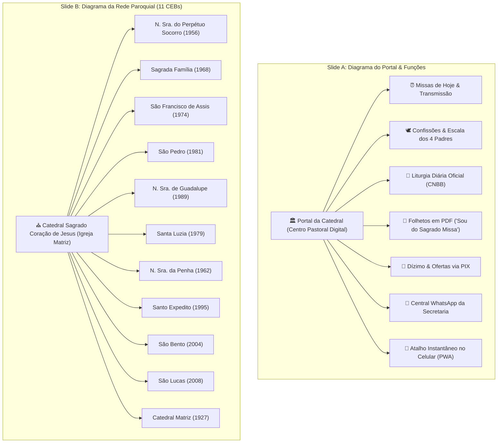

# 🗺️ Plano de Implementação: Diagramas Estruturais da Apresentação (Pe. Irineu)

## 📌 Objetivo
Adicionar **2 novos slides com diagramas visuais de alta fidelidade e riqueza estética** na apresentação executiva para o Pároco Pe. Irineu ([apresentacao_catedral_pe_irineu.html](file:///c:/Users/Start/ecclesiam-app/[documentation]/apresentacao_catedral_pe_irineu.html)):

1. **Slide 1 — Diagrama de Funções do Portal:** Nó central da Catedral ramificando-se nas principais funcionalidades e serviços que o fiel encontra no site.
2. **Slide 2 — Diagrama da Rede de CEBs:** Nó central da Matriz ramificando-se nos mini-sites das **11 Comunidades Eclesiais de Base**, evidenciando como a paróquia abraça todas as capelas com GPS, história e horários.

---

## 🏛️ Concepção Visual & Estética dos Diagramas

Para manter a solenidade católica e impressionar à primeira vista (*"Efeito UAU"*), os diagramas não serão imagens estáticas nem blocos de texto simplórios. Serão **estruturas arquiteturais interativas desenhadas com CSS puro, linhas de conexão em gradiente dourado, ícones canônicos e glassmorphism**:

---

## 🔍 Detalhamento dos 2 Novos Slides

### 🌿 Slide A: Arquitetura de Funções do Serviço
* **Título:** A Árvore de Serviços: Tudo em um Só Lugar
* **Subtítulo:** Como o paroquiano e o visitante encontram todas as respostas pastorais em menos de 10 segundos na palma da mão.
* **Layout Visual:**
  * **Hub Central:** Card de destaque com brasão da Catedral, efeito de borda luminosa dourada (*glow*).
  * **Conectores Radiais/Ramos:** Linhas estilizadas ligando o centro a 6 blocos de serviços:
    1. **Celebrações & Missas:** Grade do dia (`07:00`, `09:00`, `19:00`) com celebrante e transmissão.
    2. **Escala dos 4 Padres:** Pe. Irineu, Pe. Adilson, Pe. Deivid e Pe. Ernandes com dias de confissão.
    3. **Liturgia Diária (CNBB):** 1ª Leitura, Salmo e Evangelho abertos com 1 clique.
    4. **Folhetos Litúrgicos:** Download direto dos folhetos impressos semanais em PDF.
    5. **Dízimo & Ofertas PIX:** Sem taxas, direto na conta paroquial, botão copia-e-cola.
    6. **Secretaria & WhatsApp:** Ramais de batismo, casamento, certificados e intenções.

---

### ⛪ Slide B: A Rede Viva das 11 Comunidades (CEBs)
* **Título:** A Força da Rede: Nenhuma Capela Fica de Fora
* **Subtítulo:** A Catedral como centro de comunhão que irradia vida e comunicação para todas as comunidades do território paroquial.
* **Layout Visual:**
  * **Nó Matriz Central:** *"Igreja Matriz & Governo Pastoral"* em destaque solene.
  * **Grade de Ramificação das 11 Capelas:** Cards elegantes e compactos para cada uma das comunidades:
    * Nome da Capela & Padroeiro
    * Bairro e ano de fundação
    * Badges visuais: `GPS Integrado`, `Horários Próprios`, `História Local`
  * **Mensagem Pastoral de Apoio:** Destaque para o padre de que *as comunidades deixam de ser apenas um anexo esquecido e ganham presença digital de primeira classe*.

---

## 📍 Posicionamento no Deck de Slides

A apresentação passará de **17 para 19 slides**:
* **Slide 1:** Capa
* **Slide 2:** Sessão 01 • O Serviço (Capa de Seção)
* **Slide 3:** Diagnóstico Atual vs Solução
* **Slide 4:** Dignidade, Solenidade e Acessibilidade
* ⭐ **Slide 5 (NOVO):** **Diagrama da Árvore de Funções do Portal**
* **Slide 6:** Missas, Confissões e Escala dos 4 Padres
* ⭐ **Slide 7 (NOVO):** **Diagrama da Rede Paroquial (A Matriz e as 11 CEBs)**
* **Slide 8:** Força das Comunidades (CEBs)
* **Slide 9:** Calendário Litúrgico & CNBB
* **Slide 10:** Pastoral do Dízimo & PIX
* **Slide 11:** Painel da Secretaria
* **Slide 12:** App no Celular (PWA)
* **Slides 13 a 19:** Sessões 02 e 03 (Tecnologia, Prazos, Custos e Agência)

*(O script de navegação e os indicadores `Slide X de 19` serão atualizados automaticamente).*

---

## 🛠️ Plano de Execução & Arquivos Modificados

1. **[apresentacao_catedral_pe_irineu.html](file:///c:/Users/Start/ecclesiam-app/[documentation]/apresentacao_catedral_pe_irineu.html):**
   - Adicionar estilos CSS dedicados para nós de diagrama, ramos de ramificação (`.tree-node`, `.tree-branch`, `.hub-badge`, `.ceb-grid-diagram`).
   - Inserir as seções HTML dos 2 novos slides.
   - Atualizar a numeração dos slides e script de navegação.
2. **Sincronização Mandatória:**
   - Replicar as alterações para [c:/Users/Start/ecclesiam-app/[documentation]/planejamento/apresentacao_catedral_pe_irineu.html](file:///c:/Users/Start/ecclesiam-app/[documentation]/planejamento/apresentacao_catedral_pe_irineu.html) e a raiz do projeto.
3. **Validação Visual:**
   - Conferir a fluidez de navegação com teclado (setas) e botões Próximo/Anterior.
