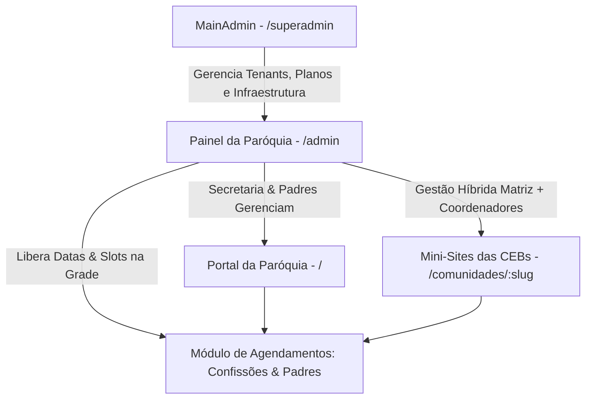

# 🏛️ Roadmap Estrutural e Arquitetura Global — Ecclesiam App

> **Documento Oficial de Estrutura e Expansão**  
> **Status:** Aprovado e Alinhado via /grill-me  
> **Versão:** 2.1  

---

## 📌 1. Visão de Arquitetura Multi-Nível

---

## 🏢 2. [MainAdmin] — Console Global do Proprietário / SaaS
* **Momento de Execução:** Imediatamente após a entrega e validação do ambiente completo (front-end e back-end) da Catedral de Colatina.
* **Arquitetura Técnica:**
  * Rota isolada `(superadmin)/superadmin` no mesmo projeto Next.js.
  * Proteção estrita por Middleware e Role `superadmin` no Supabase Auth (`auth.jwt()->>'role' = 'superadmin'`).
  * Compartilhamento direto de schemas, types TypeScript e infraestrutura sem custo adicional de múltiplos deploys.
* **Funcionalidades do Proprietário:**
  * Painel de controle de paróquias clientes (Tenants) ativas, suspensas e em onboarding.
  * Provisionamento de novos clientes com geração de slugs e mapeamento de domínios próprios.
  * Visão consolidada de métricas globais de uso, dízimo transacionado e faturamento SaaS.

---

## ⛪ 3. "Mini-Sites" das Comunidades (CEBs) — `/comunidades/[slug]`
Cada uma das 11 CEBs da Catedral (e de futuras paróquias) contará com sua subpágina dinâmica (*mini-site*), contendo:
1. **Identificação & Localização:** Foto da fachada da capela, padroeiro local, endereço com rotas GPS (Google Maps) e contato da coordenação.
2. **Horários da Comunidade:** Missas, cultos da palavra e adorações fixas daquela capela.
3. **Calendário Mensal de Atividades:** Cronograma de missas, tríduos, novenas do padroeiro e reuniões de movimentos (EAC, ECC, Terço) exclusivos da CEB.
4. **Breve História da Fundação:** Memória histórica da comunidade, ano de fundação (ex: 1956, 1962, 1986), marcos e fotos antigas.
5. **Galeria de Fotos da Comunidade:** Álbuns das festas e celebrações locais.
6. **Modelo de Permissões (Gestão Híbrida):**
   * Controle total e auditoria permanente pela Secretaria Paroquial da Matriz no painel `/admin`.
   * Suporte arquitetural a login restrito para o(a) coordenador(a) da CEB poder atualizar fotos, avisos e eventos locais da sua capela.

---

## 🕊️ 4. Módulo de Agendamento: Confissões e Atendimentos Paroquiais
Sistema onde o paroquiano pode agendar confissões sacramentais e atendimentos com os sacerdotes:
* **Grade Multissacerdotal:** A tela exibe de forma clara os horários e dias de disponibilidade de **todos os padres** (Pároco Pe. Irineu e Vigários Pe. Deivid e Pe. Ernandes).
* **Gestão de Disponibilidade pela Secretaria:**
  * A secretaria paroquial possui um calendário no painel `/admin/agendamentos` onde libera ou bloqueia datas e slots conforme a demanda e a escala pastoral dos padres.
* **Fluxo de Solicitação e Confirmação:**
  1. O fiel seleciona o sacerdote, tipo de atendimento e horário vago liberado.
  2. Informa seu Nome completo e WhatsApp.
  3. A solicitação entra com status `pendente` no painel da paróquia.
  4. A secretaria aprova e o sistema dispara a confirmação com lembrete direto no WhatsApp do fiel.
